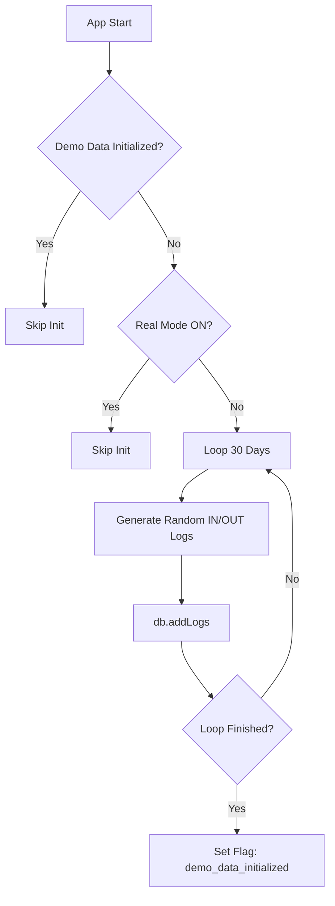
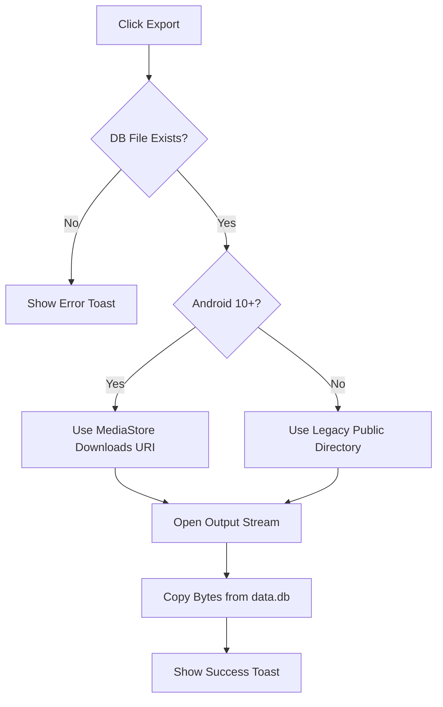
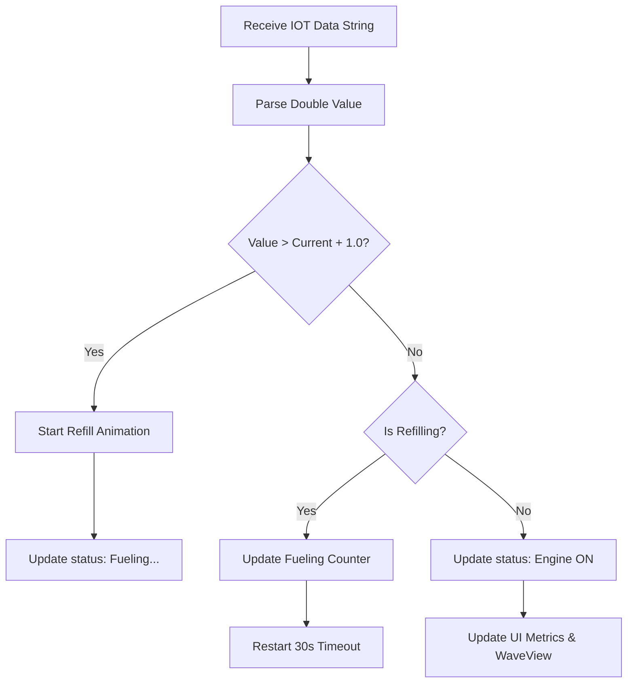
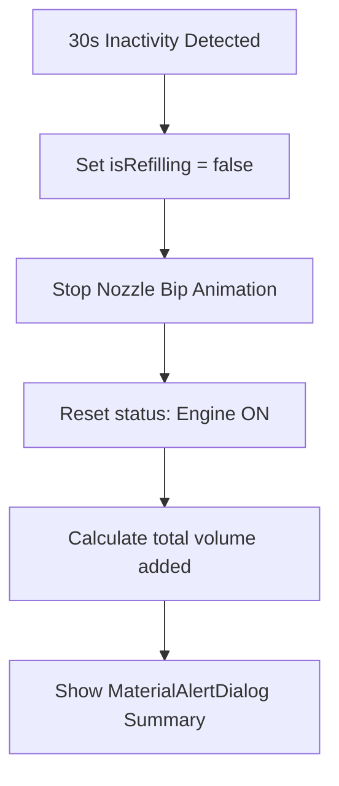
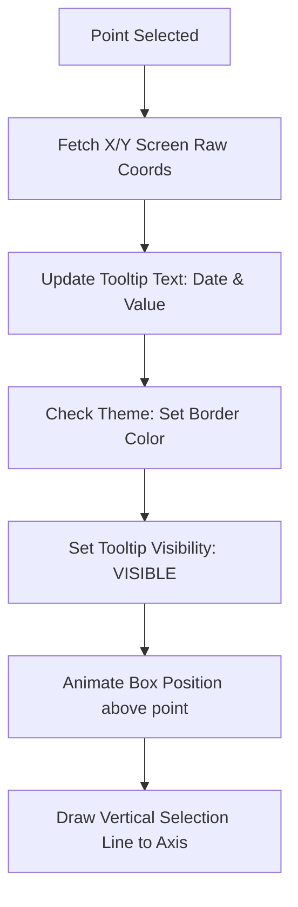
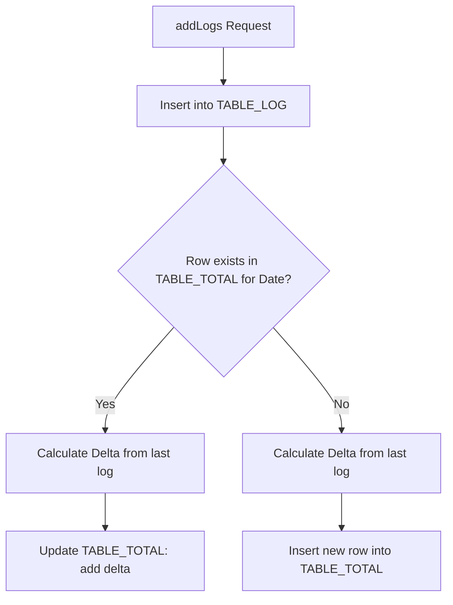
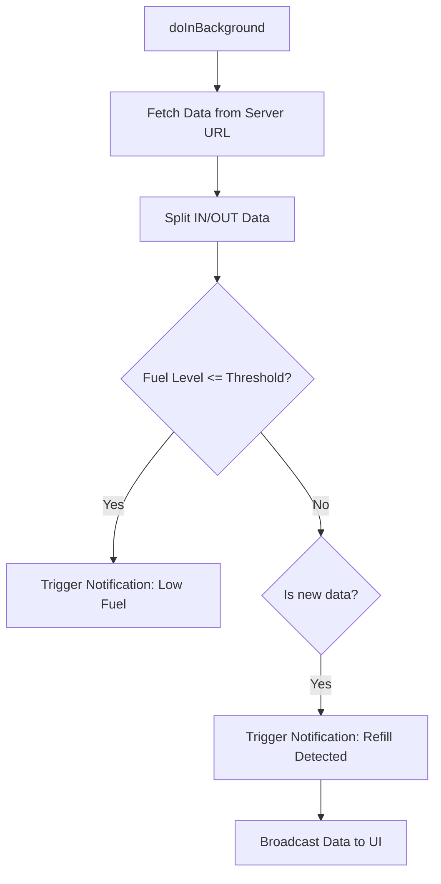
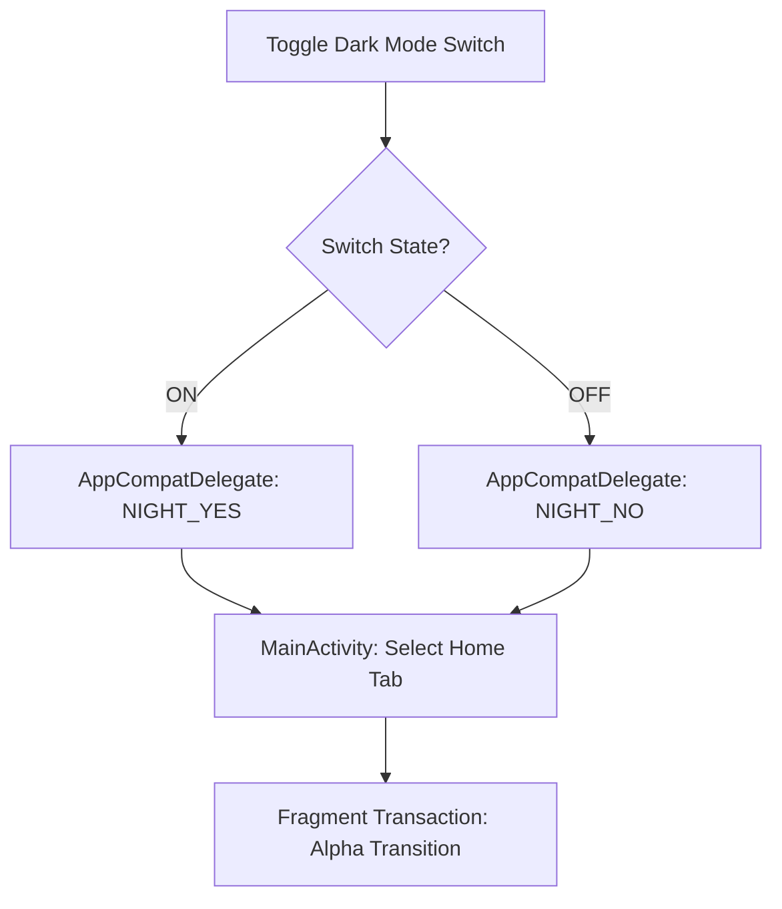

Here are the logical flow Mermaid diagrams for the core functions in this project, organized by file.
1. MainActivity.java
A. One-Time Demo Data Initialization
This logic ensures the database is populated for first-time users.
Kotlin

B. Scoped Storage DB Export
Handles exporting the database to the Downloads folder on Android 10+.
Kotlin

2. Frag1FragmentActivity.java (Home)
A. Real-time IOT Data Processing
Processes incoming fuel levels and detects refueling events.
Kotlin

B. Refill Termination & Summary
Detects when fueling stops and presents the results.
Kotlin

3. Frag2FragmentActivity.java (Analytics)
A. Interactive Tooltip Logic
Calculates coordinates and styles the tooltip dynamically on point selection.
Java

3. SQLiteHandler.java
A. Log Insertion & Intelligent Aggregation
Aggregates daily totals while supporting historical date insertion.
Kotlin

3. HttpBackgroundWorker.java
A. Background Data Fetching & Notification
Manages the hardware connection and triggers system-level alerts.
Kotlin

3. SettingsFragment.java
A. Dynamic Theme Switching
Instantly applies theme changes and resets navigation for visual confirmation.
Kotlin

